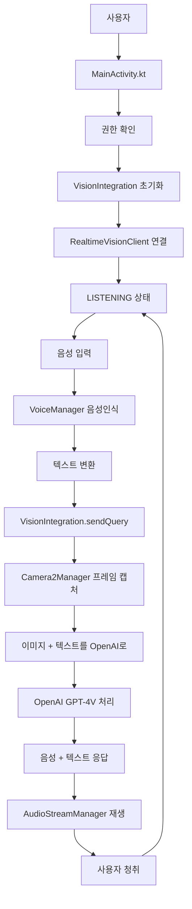

# 🔍 AR Glass Q&A 시스템 - 코드 흐름 완전 분석

## 📁 전체 파일 구조

```
D:\Data\05_CGXR\Android\XRTEST\
├── app/src/main/java/com/example/XRTEST/
│   ├── MainActivity.kt                 ⭐ [1] 앱 시작점
│   ├── camera/
│   │   └── Camera2Manager.kt          📷 [2] 카메라 처리
│   ├── voice/
│   │   └── VoiceManager.kt            🎤 [3] 음성 처리  
│   ├── vision/
│   │   ├── RealtimeVisionClient.kt    🤖 [4] OpenAI API 클라이언트
│   │   ├── AudioStreamManager.kt      🔊 [5] 24kHz 오디오 처리
│   │   └── VisionIntegration.kt       🎯 [6] 전체 통합 관리자
│   ├── ui/
│   │   └── CrosshairOverlay.kt        ⊕ [7] 십자가 UI
│   └── network/
│       ├── A2AClient.kt               🌐 [8] Agent 통신
│       └── A2AModels.kt               📋 [9] 데이터 모델
├── build.gradle.kts                   ⚙️ [10] 빌드 설정
├── AndroidManifest.xml                📋 [11] 권한 설정
└── docs/ ← 이 폴더!
    ├── CODE_FLOW_GUIDE.md            📖 지금 이 파일
    ├── FILE_BY_FILE_EXPLANATION.md   📝 파일별 상세 설명
    └── VISUAL_FLOWCHART.md           🎨 시각적 흐름도
```

---

## 🚀 **앱 실행 흐름** (따라가기 쉽게!)

### **1단계: 앱 시작** 📱
```kotlin
MainActivity.kt (onCreate) 
    ↓
"앱 실행!" → 권한 요청 (카메라, 마이크)
    ↓
UI 선택: XR 모드 or 2D 모드
```

### **2단계: 시스템 초기화** ⚙️
```kotlin
MainActivity.kt (My2DContent/MySpatialContent)
    ↓
Camera2Manager 초기화 → 카메라 준비
VoiceManager 초기화 → 음성 인식 준비  
VisionIntegration 초기화 → OpenAI 연결 준비
```

### **3단계: OpenAI 연결** 🔗
```kotlin
VisionIntegration.kt (startSession)
    ↓ 
RealtimeVisionClient.kt (connect)
    ↓
WebSocket 연결: wss://api.openai.com/v1/realtime
    ↓
"연결됨!" → LISTENING 상태로 변경
```

### **4단계: 사용자 질문** 🎤
```kotlin
사용자 음성 입력
    ↓
VoiceManager.kt (음성 인식)
    ↓
텍스트 변환: "이게 뭐야?"
    ↓
MainActivity.kt에서 감지 → VisionIntegration.sendQuery() 호출
```

### **5단계: 이미지 + 질문 전송** 📸
```kotlin
VisionIntegration.kt (sendQuery)
    ↓
Camera2Manager에서 현재 프레임 가져오기
    ↓
이미지 크기 조정 (1024x1024 이하)
    ↓
RealtimeVisionClient.sendImageWithPrompt()
    ↓ 
OpenAI에 WebSocket으로 전송:
- 이미지 (Base64)
- 질문 텍스트
```

### **6단계: OpenAI 응답 처리** 🤖
```kotlin
RealtimeVisionClient.kt (handleRealtimeEvent)
    ↓
OpenAI에서 응답 수신:
- response.audio.delta → 음성 데이터 조각들
- response.text.delta → 텍스트 응답 조각들
    ↓
음성 조각들을 모아서 완성된 오디오 생성
```

### **7단계: 음성 재생** 🔊
```kotlin
AudioStreamManager.kt (playAudio)
    ↓
24kHz PCM16 오디오를 Android AudioTrack으로 재생
    ↓
사용자가 AR Glass 스피커로 답변 청취
    ↓
완료! → 다시 LISTENING 상태로 돌아감
```

---

## 🎯 **핵심 파일별 역할**

| 파일 | 핵심 역할 | 주요 함수 |
|------|----------|----------|
| **MainActivity.kt** | 🎮 전체 앱 제어 | `onCreate()`, `My2DContent()` |
| **VisionIntegration.kt** | 🎯 시스템 통합 | `startSession()`, `sendQuery()` | 
| **RealtimeVisionClient.kt** | 🤖 OpenAI 통신 | `connect()`, `sendImageWithPrompt()` |
| **AudioStreamManager.kt** | 🔊 음성 처리 | `playAudio()`, `startRecording()` |
| **Camera2Manager.kt** | 📷 카메라 제어 | `startCamera()`, `processFrame()` |
| **VoiceManager.kt** | 🎤 음성 인식 | `startListening()`, `speak()` |

---

## 🔄 **데이터 흐름**



---

## 🚨 **에러 처리 흐름**

### **권한 거부** → 에러 메시지 + 재요청
### **OpenAI 연결 실패** → 자동 재연결 (최대 5회)
### **음성 인식 실패** → VoiceManager에서 재시도
### **카메라 접근 실패** → Camera2Manager에서 대체 해상도 시도

---

## 📝 **상태 변화 추적**

VisionIntegration의 상태를 보면 현재 시스템 상황을 알 수 있습니다:

```kotlin
enum class IntegrationState {
    IDLE,           // 대기 상태
    CONNECTING,     // OpenAI 연결 중  
    READY,          // 연결 완료, 세션 준비
    LISTENING,      // 음성 입력 대기 중
    PROCESSING,     // AI 처리 중
    RESPONDING,     // 응답 재생 중
    ERROR           // 오류 발생
}
```

**UI에서 이 상태를 실시간으로 표시**:
- 🔌 CONNECTING: "Connecting to OpenAI..."
- 🎤 LISTENING: "Ask me about what you see!"
- 🤖 PROCESSING: "Processing with GPT-4V..."
- 💬 RESPONDING: "Generated response playing..."

---

## 🎨 **UI 요소**

### **CrosshairOverlay.kt**: 십자가 표시
- 평상시: 흰색 십자가
- 처리 중: 주황색으로 변경 + 애니메이션
- 에러 시: 빨간색으로 표시

### **Android XR UI**:
- **3D 모드**: `MySpatialContent()` - 공간에 떠있는 패널
- **2D 모드**: `My2DContent()` - 일반 스마트폰 UI

---

## 🔧 **개발자 디버깅 팁**

### **로그 확인**:
```bash
adb logcat | grep -E "(MainActivity|VisionIntegration|RealtimeVisionClient)"
```

### **상태 확인**:
- VisionIntegration.state → 현재 시스템 상태
- RealtimeVisionClient.connectionState → OpenAI 연결 상태
- VoiceManager.recognizedText → 마지막 음성 인식 결과

### **네트워크 확인**:
- WebSocket 연결: `ws://api.openai.com/v1/realtime` 
- HTTP 상태 코드 확인
- API 키 유효성 (`BuildConfig.OPENAI_API_KEY`)

---

**다음 파일**: `FILE_BY_FILE_EXPLANATION.md`에서 각 파일의 상세 코드 설명을 확인하세요! 📖