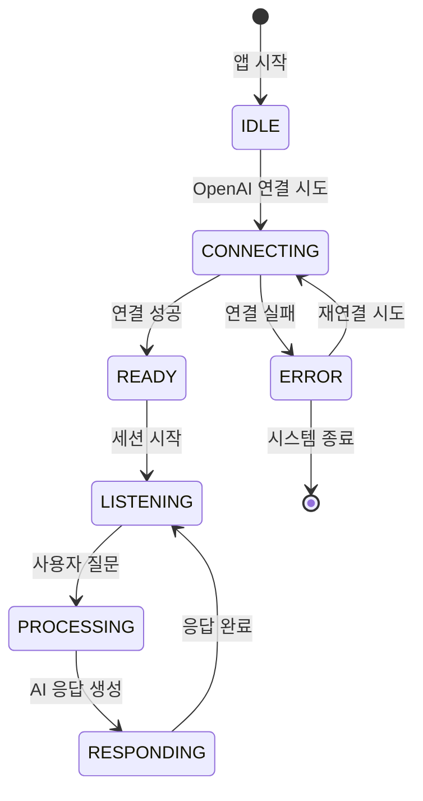

# 🎨 AR Glass Q&A 시스템 - 시각적 흐름도

## 🗂️ 전체 파일 구조 한눈에 보기

```
📁 AR Glass Q&A System
│
├── 📱 UI Layer (사용자 화면)
│   ├── MainActivity.kt ⭐ 앱 시작점
│   └── CrosshairOverlay.kt ⊕ 십자가 타겟
│
├── 🎯 Integration Layer (통합 관리)
│   └── VisionIntegration.kt 🎮 전체 시스템 지휘관
│
├── 🤖 AI Communication Layer (OpenAI 통신)
│   ├── RealtimeVisionClient.kt 🌐 OpenAI API 클라이언트
│   └── AudioStreamManager.kt 🔊 24kHz 음성 처리
│
├── 📷 Input Layer (입력 처리)
│   ├── Camera2Manager.kt 📸 카메라 제어
│   └── VoiceManager.kt 🎤 음성 인식/TTS
│
└── 🌐 Network Layer (통신)
    ├── A2AClient.kt 📡 Agent 간 통신
    └── A2AModels.kt 📋 데이터 모델
```

---

## 🔄 **전체 데이터 흐름 - 한눈에!**

```
👤 사용자
  ↓ 음성 질문: "이게 뭐야?"
🎤 VoiceManager.kt
  ↓ 텍스트 변환
📱 MainActivity.kt
  ↓ 이벤트 감지
🎯 VisionIntegration.kt ← ─ ─ ─ ─ ┐
  ↓ sendQuery()                    │
📷 Camera2Manager.kt               │ 통합 관리
  ↓ 현재 프레임 캡처                │
🎯 VisionIntegration.kt ← ─ ─ ─ ─ ┘
  ↓ 이미지 + 텍스트
🤖 RealtimeVisionClient.kt
  ↓ WebSocket 전송
☁️ OpenAI GPT-4V API
  ↓ AI 분석 + 음성 생성
🤖 RealtimeVisionClient.kt
  ↓ 응답 수신
🔊 AudioStreamManager.kt
  ↓ 24kHz 고품질 재생
🔈 AR Glass 스피커
  ↓
👂 사용자가 답변 청취
```

---

## 📊 **시스템 상태 변화 흐름**



### **각 상태별 UI 표시**:
- 😴 **IDLE**: "시스템 준비 중..."
- 🔌 **CONNECTING**: "OpenAI에 연결 중..."
- ✅ **READY**: "연결 완료! 세션 시작..."
- 🎤 **LISTENING**: "십자가로 조준하고 질문하세요!" (십자가: ⚪ 흰색)
- 🤖 **PROCESSING**: "GPT-4V가 분석 중..." (십자가: 🟠 주황색)
- 💬 **RESPONDING**: "AI 답변 재생 중..." (십자가: 🟠 주황색)
- ❌ **ERROR**: "오류 발생 - 재시작하세요" (십자가: 🔴 빨간색)

---

## 🎯 **사용자 관점에서 본 전체 흐름**

```
1️⃣ 📱 앱 실행
   └── "AR Glass Q&A" 앱 아이콘 터치
   
2️⃣ 🔒 권한 요청
   ├── "카메라 권한을 허용하시겠습니까?" → ✅ 허용
   └── "마이크 권한을 허용하시겠습니까?" → ✅ 허용
   
3️⃣ 🔌 시스템 초기화
   ├── "OpenAI에 연결 중..." (3-5초)
   └── ✅ "연결 완료!"
   
4️⃣ 🎯 대기 상태
   ├── 화면 중앙에 ⚪ 흰색 십자가 표시
   └── "십자가로 조준하고 질문하세요!"
   
5️⃣ 👀 물체 조준
   └── AR Glass로 궁금한 물체에 십자가 맞추기
   
6️⃣ 🎤 음성 질문
   └── "이게 뭐야?", "이거 어떻게 써?" 등 자연스럽게 질문
   
7️⃣ 🤖 AI 처리
   ├── 십자가가 🟠 주황색으로 변경
   ├── "GPT-4V가 분석 중..." 메시지 표시
   └── 3-7초 대기
   
8️⃣ 💬 AI 답변
   ├── 고품질 음성으로 자연스러운 답변 재생
   └── "이것은 스마트폰입니다. 전화, 메시지, 인터넷 등..."
   
9️⃣ 🔄 반복
   └── 십자가가 다시 ⚪ 흰색으로 변경 → 다음 질문 대기
```

---

## 🏗️ **개발자 관점: 시스템 아키텍처**

```
┌─────────────────────────────────────────────────────────┐
│                    📱 UI Layer                          │
│  ┌─────────────────┐    ┌──────────────────────────────┐ │
│  │ MainActivity.kt │────│ CrosshairOverlay.kt          │ │
│  │ (앱 시작점)       │    │ (십자가 타겟 UI)              │ │
│  └─────────────────┘    └──────────────────────────────┘ │
└─────────────────────────────────────────────────────────┘
                              │
                              ▼
┌─────────────────────────────────────────────────────────┐
│                🎯 Integration Layer                      │
│            ┌──────────────────────────────────┐         │
│            │      VisionIntegration.kt        │         │
│            │    (전체 시스템 오케스트레이터)     │         │
│            └──────────────────────────────────┘         │
└─────────────────────────────────────────────────────────┘
                              │
                   ┌──────────┼──────────┐
                   ▼          ▼          ▼
┌─────────────┐ ┌─────────────┐ ┌─────────────────────────┐
│ 📷 Camera   │ │ 🎤 Voice    │ │     🤖 AI Layer         │
│   Layer     │ │   Layer     │ │                         │
│ Camera2     │ │ Voice       │ │ RealtimeVisionClient.kt │
│ Manager.kt  │ │ Manager.kt  │ │ AudioStreamManager.kt   │
└─────────────┘ └─────────────┘ └─────────────────────────┘
                                            │
                                            ▼
                                ┌───────────────────────┐
                                │   ☁️ OpenAI Cloud     │
                                │   GPT-4V Realtime    │
                                │   API (WebSocket)     │
                                └───────────────────────┘
```

---

## 🎬 **실행 시나리오별 상세 흐름**

### **🔄 시나리오 1: 정상 동작**
```
👤 사용자: "저 컵이 뭐야?"
    ↓
🎤 VoiceManager: 음성 → "저 컵이 뭐야?" 텍스트 변환
    ↓
📱 MainActivity: 텍스트 변화 감지 → VisionIntegration.sendQuery() 호출
    ↓
🎯 VisionIntegration: 상태를 PROCESSING으로 변경
    ↓
📷 Camera2Manager: 현재 프레임 캡처 (1920x1080 → 1024x1024 리사이즈)
    ↓
🤖 RealtimeVisionClient: Base64 이미지 + 텍스트를 WebSocket으로 전송
    ↓
☁️ OpenAI: GPT-4V가 이미지 분석 + 답변 생성 (3-7초)
    ↓
🤖 RealtimeVisionClient: 24kHz 음성 응답 수신 (실시간 스트리밍)
    ↓
🔊 AudioStreamManager: 고품질 음성 재생
    ↓
👂 사용자: "이것은 세라믹 머그컵입니다. 따뜻한 음료를 마실 때 사용합니다..."
    ↓
🎯 VisionIntegration: 상태를 LISTENING으로 복귀
```

### **⚠️ 시나리오 2: 에러 처리**
```
🔌 OpenAI 연결 실패
    ↓
🤖 RealtimeVisionClient: 자동 재연결 시도 (최대 5회)
    ↓
❌ 5회 실패 시: ERROR 상태로 변경
    ↓
📱 UI: "❌ 연결 오류 - 네트워크를 확인하세요" 표시
    ↓
🔄 사용자가 앱 재시작 시: 처음부터 다시 시도
```

### **🎤 시나리오 3: 음성 인식 실패**
```
👤 사용자: (너무 작은 목소리로) "이게 뭐야?"
    ↓
🎤 VoiceManager: 음성 인식 실패 → null 반환
    ↓
📱 MainActivity: 변화 감지되지 않음 → 계속 LISTENING 상태 유지
    ↓
💡 사용자에게 "더 크고 명확하게 말씀해주세요" 안내
```

---

## 🎨 **UI 상태별 화면 구성**

### **1️⃣ 앱 시작 화면**
```
┌─────────────────────────────────────┐
│                                     │
│            AR Glass Q&A             │
│                                     │
│         🔌 OpenAI 연결 중...         │
│                                     │
│                                     │
│                                     │
│                                     │
└─────────────────────────────────────┘
```

### **2️⃣ 대기 상태 (LISTENING)**
```
┌─────────────────────────────────────┐
│                                     │
│                 ⊕                   │ ← 흰색 십자가
│             (흰색 십자가)              │
│                                     │
│                                     │
│                                     │
│  🎤 십자가로 조준하고 질문하세요!        │
│                                     │
└─────────────────────────────────────┘
```

### **3️⃣ 처리 상태 (PROCESSING)**
```
┌─────────────────────────────────────┐
│                                     │
│                 ⊕                   │ ← 주황색 십자가
│             (주황색 십자가)             │   (애니메이션)
│                                     │
│                                     │
│                                     │
│      🤖 GPT-4V가 분석 중...          │
│                                     │
└─────────────────────────────────────┘
```

### **4️⃣ 응답 상태 (RESPONDING)**
```
┌─────────────────────────────────────┐
│                                     │
│                 ⊕                   │ ← 주황색 십자가
│             (주황색 십자가)             │   (맥박 효과)
│                                     │
│                                     │
│                                     │
│  💬 "이것은 스마트폰입니다. 전화..."     │
│                                     │
└─────────────────────────────────────┘
```

---

## 🔧 **개발자 디버깅 가이드**

### **📊 상태 추적**
```kotlin
// VisionIntegration 상태 확인
Log.d("DEBUG", "Current state: ${visionIntegration.state.value}")

// OpenAI 연결 상태 확인  
Log.d("DEBUG", "Connection: ${realtimeClient.connectionState.value}")

// 마지막 음성 인식 결과
Log.d("DEBUG", "Last speech: ${voiceManager.recognizedText.value}")
```

### **🔍 로그 필터링**
```bash
# 전체 시스템 로그
adb logcat | grep -E "(MainActivity|VisionIntegration|RealtimeVisionClient)"

# OpenAI 통신 로그만
adb logcat | grep "RealtimeVisionClient"

# 음성 관련 로그만
adb logcat | grep -E "(VoiceManager|AudioStreamManager)"
```

### **⚡ 성능 모니터링**
- **응답 시간**: OpenAI 요청 → 응답 수신 (목표: 3-7초)
- **음성 품질**: 24kHz PCM16 유지 확인
- **메모리 사용량**: 이미지 처리 시 메모리 누수 방지
- **배터리 소모**: 연속 사용 시 최적화 필요

---

## 🎯 **전체 시스템 한 줄 요약**

```
📱 MainActivity → 🎯 VisionIntegration → 🤖 OpenAI → 🔊 AudioStream → 👂 사용자
     ↑              ↓           ↑                                      
   📱 UI         📷 Camera    🎤 Voice                                  
```

**"카메라로 보고, 음성으로 묻고, AI가 답하는 완전 자동화 시스템!"** 🚀

---

**🎉 이제 전체 시스템이 어떻게 돌아가는지 완벽하게 이해하셨나요?**

다음 단계는 실제 빌드 & 테스트입니다! 🏗️✨